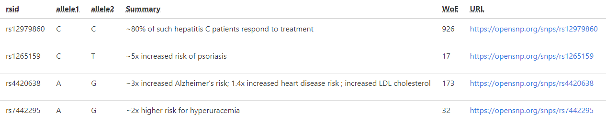
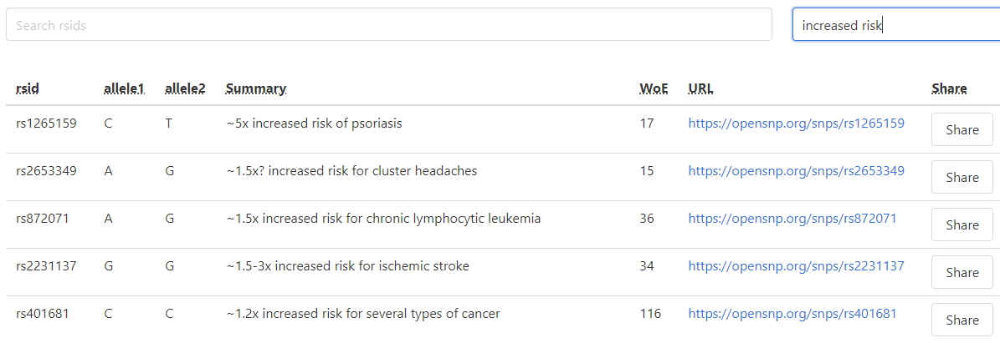
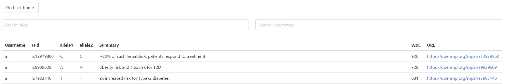

# Open Genome Explorer

## About Open Genome Explorer


Open Genome Explorer is a web app that utilizes the genetic information the user uploads in order to provide insights about their genome. By using data provided by open source SNP database [OpenSNP](https://opensnp.org/), the user may learn more about their health traits and genetic risk factors based on the genetic information they upload.

## Usage

* Create an account using built-in py4web auth and sign in.
* Upload your SNP array from sources like 23andMe or AncestryDNA. `test-genome.txt` is included for testing. The data in the file should follow the format:
| rsid        | chromosome  | position  | genotype  |
| ----------- | ----------- | --------- | --------- |
| rs2478267   | 1           | 7584814   | GG        |
| rs2013624   | 1           | 7588413   | CC        |
|...          | ...         | ...       | ...       |
* Once the file has been processed, any data matching known good SNP data will be displayed in a table.

* Sort the table by any column by clicking on the column.
* Search for results by rsid or summary by typing into the rsid or summary box.

* Clicking on a URL will open the openSNP page containing detailed results in a new tab.
* Pressing Share will add your SNP to a public page that any viewer see.

* Pressing Comment will allow you to add comments to a SNP.
* Pressing on a SNP will load that SNP's page and all comments associated.

## Initial Setup

### Install Dependencies

From the root directory run

```bash
pip -r requirements.txt
```

### Run

From the root directory run the app with

```bash
py4web run apps
```

## Deployment

For instructions related to deployment, see `deployment_tools/gae/README.md`

### Using GCS (put this in deployment_tools/gae/README.md)

It is possible to set up a Google Cloud Service bucket to hold the somewhat sizable files and allow scalability. To do this you must first set up a GCS account and do some provisioning.

> Note: Instructions taken from <https://github.com/learn-py4web/gcs_file_storage>

#### Configure the upload bucket on GCS

* Create a [Google Cloud Project](https://console.cloud.google.com), and
  [configure billing](https://console.cloud.google.com/billing).
* [Create a storage bucket](https://console.cloud.google.com/storage/browser).  
* Create a [service account](https://console.cloud.google.com/iam-admin/serviceaccounts), with a name such as `filemanager@yourproject.
  iam.gserviceaccount.com`, where `filemanager` is the name of the "user" for the account, and `yourproject` is the name of the service account.
* Download the json credentials for the above service account, and store them in a file in `private/gcs_keys.json` in this app.  Make sure the file is also in `.gitignore`!
* Go to the [Google Cloud Console, then to Storage, then to Browse](https://console.cloud.google.com/storage/browser).  Click
  on the bucket options on the right, then on _permissions_, and add the
  service account with the permission _Storage Object Admin_ to the bucket permissions.
* Set up the bucket for CORS.  [Install `gsutils` if needed](<https://cloud.google.com/storage/docs/gsutil_install>), then run:

```bash
gsutil cors set /path/to/cors_json_file.json gs://bucketname
```

Finally, you must set `USE_GCS` to `True` in the `settings.py` file

## Implementation

This app is implemented using the Py4web framework, Vue.js JavaScript framework, Bulma css, and Font Awesome icons.

Genomic information uploaded by the user is parsed and compared to known good SNP data taken from OpenSNP, stored in `good_snp_data.json`. A test file is provided, `test-genome.txt`. Every match found is added to a table, SNP. A separate function retrieves the SNPs, which is returned to and filtered by the frontend to be displayed. Uploading another file will insert rows into the table that were not there before, or update them otherwise.

Sorting the table occurs as a request to the backend, which retrieves data from the SNPs table in an order specified by the frontend. This data is updated in the frontend as a `user_snps` variable.

Shared SNPs are stored in a shared_SNP table by the backend, which contains publically shared SNPs and is referred to by comments, which are also handled by the backend.